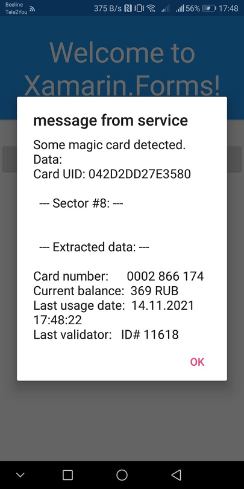

# TroikaX (Transport card "Troika" data reader/fetcher) 

## Description
This repository is NFC App prototype (draft, sketch) made with Xamarin Forms tech specially for Android system. 
(the original source code was the Troika Dumper, the nativ Android application on Java). 
This app cannot write data, but reads some important parameters: the UID, balance of transport card, etc.
Please note: this is only technology prototype, my result of NFC-on-Android micro-RnD. 

## Screenshots

# Contribute!
There's still a TON of things missing from this proof-of-concept (MVP) and areas of improvement 

With best wishes,

  [m][e] 2021

## Thanks!
I wanted to put down some thank you's here for folks/projects/websites that were invaluable 
for helping me get this project into a functional state:
- [Igor Shevtsov](https://github.com/gshevtsov/) -Great Java developer/researcher
- [TroikaDumper](https://github.com/gshevtsov/TroikaDumper/) -Troika Dumper app with nfc data parser (balance, etc.) 

TroikaX is RnD project only. AS-IS. No support. Distributed under the MIT License.  
        
